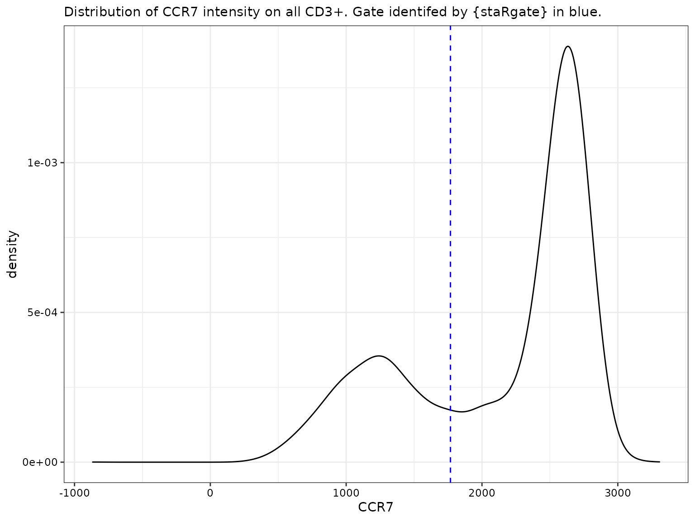
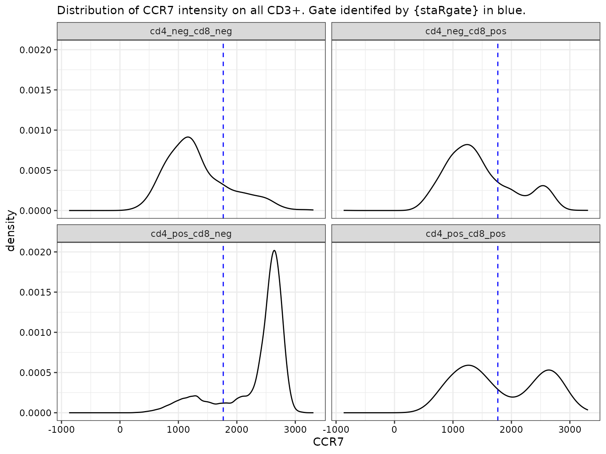
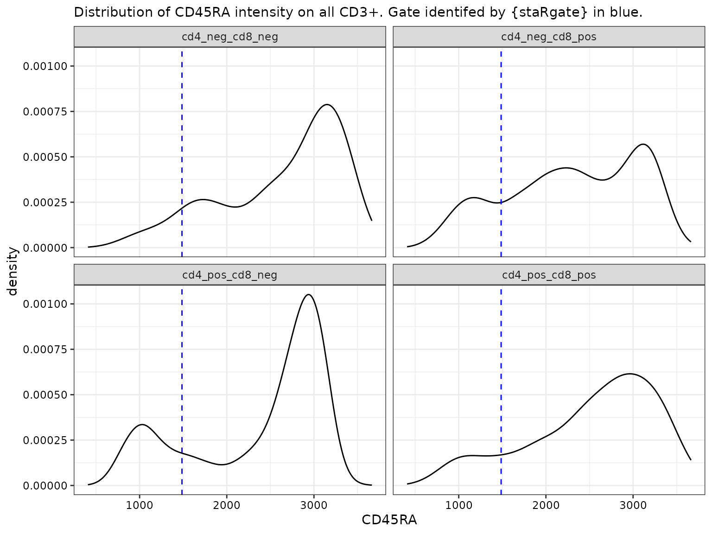
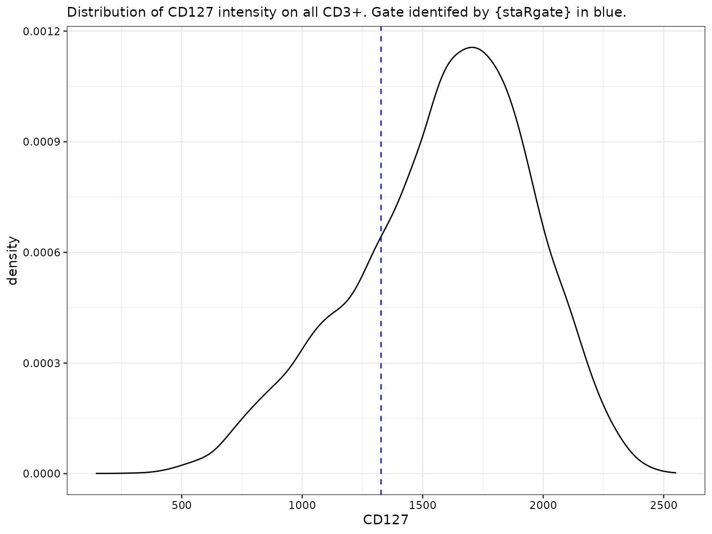
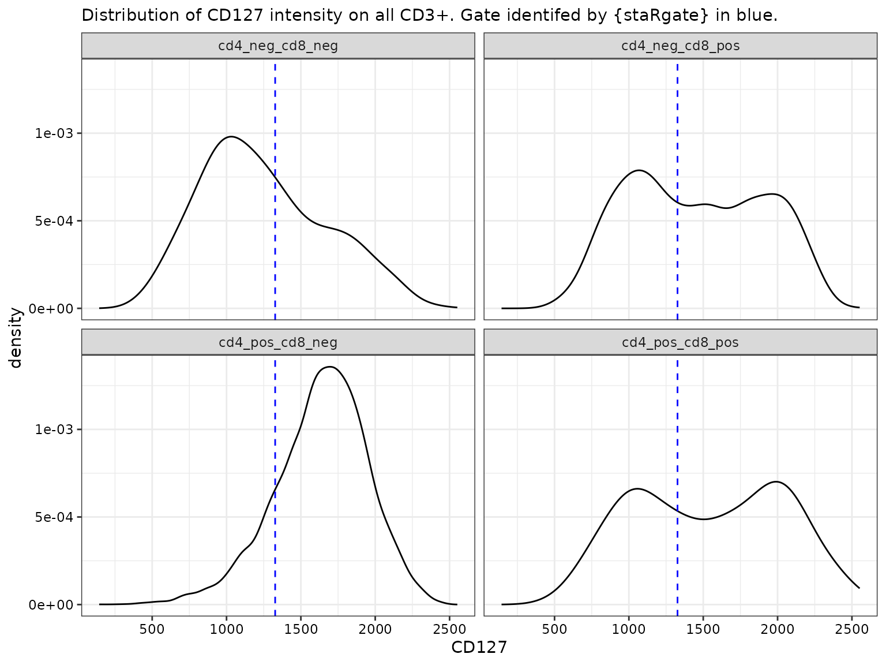
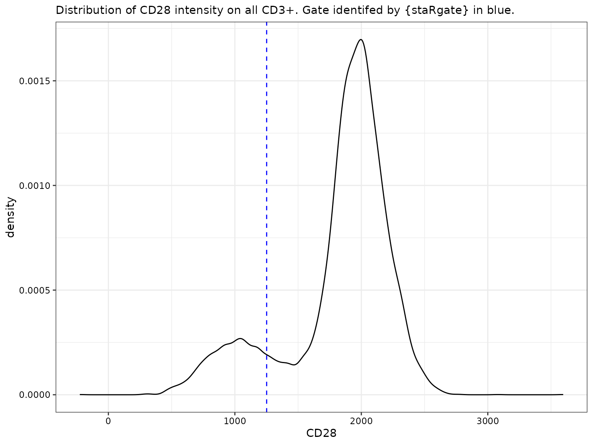

# Tutorial: Running the pipeline

## Introduction

staRgate is an automated gating pipeline to process and analyze flow
cytometry data to characterize the lineage, differentiation and
functional states of T-cells.

This pipeline is designed to mimic the manual gating strategy of
defining flow biomarker positive populations relative to a unimodal
background population to include cells with varying intensities of
marker expression. This is achieved via estimating the kernel density of
the intensity distribution and corresponding derivatives. This pipeline
integrates the density gating method in conjuction with some
pre-processing steps achieved via the R package
*[openCyto](https://bioconductor.org/packages/3.22/openCyto)* and an
optional step with
*[flowAI](https://bioconductor.org/packages/3.22/flowAI)*. The flow data
is stored within R as a `GatingSet` object, which makes it easily
transferable to other flow cytometry workflows available on
BioConductor.

This vignette will walk through how to run the {staRgate} pipeline
starting from importing an flow cytometry standard (FCS) file into R to
preprocessing and gating, as well as identifying T-cell subpopulations
for downstream analysis. This pipeline returns results at the
single-cell level as well as the summarized sample-level data (for the
percentages of positively expressing cells when identifying the
subpopulations).

For illustration purposes, the example FCS file used in this vignette
and stored in the package data is a concatenated file limited to the
first 30k events/cells acquired to reduce the run time and file size.

After running {staRgate} to gate flow cytometry data, it is recommended
to perform some quality checks (QC) on the gate placements to ensure
they are reasonable. We suggest to use ridgeplots in addition to the
[`ggcyto::autoplot`](https://ggplot2.tidyverse.org/reference/autoplot.html)
to visualize the density distributions per marker across samples. When
examining a large batch of samples, downsampling, such as to a random
sample of 10k CD3+ cells, will make the QC process more manageable. In
addition, random spot checks of a few samples would also be helpful QC
to detect any edge cases.

Currently in this tutorial, we do not extend to the QC steps and suggest
to lean on other examples for how to put together a ridgeplot for
example. In the near future, we hope to incorporate some examples for
the additional QC steps as well, stay tuned!

## Installation

The {staRgate} package relies on a few Biocondcutor R packages. Before
installing {staRgate}, first setup Bioconductor and install all
dependencies.

[Follow instructions here for installing
Bioconductor](https://www.bioconductor.org/install/)

The essential dependencies for running the {staRgate} package include:
*[flowCore](https://bioconductor.org/packages/3.22/flowCore)*, and
*[flowWorkspace](https://bioconductor.org/packages/3.22/flowWorkspace)*.

The following packages are needed to fully run the pipeline as shown in
this Tutorial, but not required for the {staRgate} code chunks to run:
*[openCyto](https://bioconductor.org/packages/3.22/openCyto)*,
*[ggplot2](https://CRAN.R-project.org/package=ggplot2)*,
*[ggcyto](https://bioconductor.org/packages/3.22/ggcyto)*,
*[gt](https://CRAN.R-project.org/package=gt)*

``` r
# Load libraries
library(staRgate)
library(openCyto)
library(flowWorkspace)
#> As part of improvements to flowWorkspace, some behavior of
#> GatingSet objects has changed. For details, please read the section
#> titled "The cytoframe and cytoset classes" in the package vignette:
#> 
#>   vignette("flowWorkspace-Introduction", "flowWorkspace")
library(flowCore)
# Just for plotting in the vignette
library(ggplot2)
library(ggcyto)
#> Loading required package: ncdfFlow
#> Loading required package: BH

# Set up dynamic variables
pt_samp_nm <- "flow_sample_1"

## File path to the FCS file
path_fcs <- system.file("extdata", "example_fcs.fcs", package = "staRgate", mustWork = TRUE)

## File path to the compensation matrix csv file
## Expect format to match flowJo exported version
path_comp_mat <- system.file("extdata", "comp_mat_example_fcs.csv", package = "staRgate", mustWork = TRUE)

## File path for outputs/saving
# Maybe not the best sol, but create a temp dir?
path_out <- tempdir()
# Print the path_out for user to see
path_out
#> [1] "/tmp/RtmpFDxsEo"

## File path Gating template
gtFile <- system.file("extdata", "gating_template_x50_tcell.csv", package = "staRgate", mustWork = TRUE)

## File path to biexp parameters
## Expects 4 columns: full_name, ext_neg_dec, width_basis, positive_dec
## full name should contain the channel/dye name
# 3 remaining cols fill in with desired parameter values
path_biexp_params <- system.file("extdata", "biexp_transf_parameters_x50.csv", package = "staRgate", mustWork = TRUE)

## File path to positive peak thresholds
path_pos_peak_thresholds <- system.file("extdata", "pos_peak_thresholds.csv", package = "staRgate", mustWork = TRUE)
```

## Input files and function parameters

In order to run the pipeline, the user must have the data in flow
cytometry standard (FCS) format. This is usually the output from flowJo.
All of these input files except the `bin size` are expected to be
comma-separated values (csv) files. Please see the `inst` folder of the
package for examples of the formats.

- Compensation matrix from manual gating-
  - Matrix where the column and row names correspond to the channel
    names, cell values correspond to the spillover correction to be
    applied.
  - This can be exported as a csv in flowJo’s options
- Biexponential transformation parameters-
  - This is a table specifying the parameters (negative decades, width
    basis and positive decades) to be applied to the listed channels
- Gating template
  - A gating template is required to run the pre-gating via
    *[openCyto](https://bioconductor.org/packages/3.22/openCyto)*
  - The package includes a gating template tailored for gating this
    panel of T-cell markers.
  - For examples of how to modify the gating template, please refer to
    the [openCyto
    documentation](https://www.bioconductor.org/packages/devel/bioc/vignettes/openCyto/inst/doc/HowToWriteCSVTemplate.html).
- Bin size
  - From a systematic grid search, we have found bin sizes of 40 to 50
    works well for the density gating

A few things to keep in mind when debugging/iterating through gating:

- If saving at the same path with same name (i.e., rerunning the same
  code), the GatingSet folder from the
  [`flowWorkspace::save_gs()`](https://rdrr.io/pkg/flowWorkspace/man/save_gs.html)
  command needs to be deleted for
  *[openCyto](https://bioconductor.org/packages/3.22/openCyto)* to save
  again, otherwise, will encounter an error related to an invalid path
  from the
  [`flowWorkspace::save_gs()`](https://rdrr.io/pkg/flowWorkspace/man/save_gs.html)
  function

## Example

Below is an example of gating 1 FCS sample.

### Import FCS

``` r
# Read in gating template
dtTemplate <- data.table::fread(gtFile)

# Load the FCS
gt_tcell <- openCyto::gatingTemplate(gtFile)
#> expanding pop: -/++/-
#> Adding population:fsc_ssc_qc
#> Adding population:nonDebris
#> Adding population:singlets
#> Adding population:cd14-cd19-
#> Adding population:live
#> Adding population:cd3
#> Adding population:cd4+
#> Adding population:cd8+
#> Adding population:cd4+cd8+
#> Adding population:cd4-cd8+
#> Adding population:cd4+cd8-
#> Adding population:cd4-cd8-

cs <- flowWorkspace::load_cytoset_from_fcs(path_fcs)

# Create a GatingSet of 1 sample
gs <- flowWorkspace::GatingSet(cs)

# Check- how many cells is in the FCS file?
n_root <- flowWorkspace::gh_pop_get_count(gs, "root")

# The example FCS has 30000 cells
n_root
#> [1] 30000
```

### Compensation

``` r
# Apply comp
gs <- getCompGS(gs, path_comp_mat = path_comp_mat)

# Can check that the comp was applied
chk_cm <- flowWorkspace::gh_get_compensations(gs)

# Not aware of an accessor that we can use for this
head(methods::slot(chk_cm, "spillover"), 2)
#>          AF700-A     APC-A APC-f750-A      BB515-A    BB660-A    BB700-A
#> AF700-A 1.000000 0.0248301  0.2492840  0.009679220 0.00268438 0.04732480
#> APC-A   0.132334 1.0000000  0.0337338 -0.000160633 0.01598550 0.00443383
#>            BB790-A    BUV395-A     BUV496-A     BUV563-A   BUV615-A   BUV661-A
#> AF700-A 0.01730770 0.001813870  1.81722e-03  1.45041e-03 0.00249455 0.00220337
#> APC-A   0.00122597 0.000471851 -5.18352e-05 -3.25396e-05 0.00127167 0.11436300
#>          BUV737-A   BUV805-A      BV421-A     BV480-A     BV510-A     BV570-A
#> AF700-A 0.1387160 0.03310420  5.11994e-05 0.003390200 2.60901e-03 2.45899e-03
#> APC-A   0.0221613 0.00527436 -4.09868e-04 0.000113668 4.37466e-05 5.85607e-05
#>            BV605-A    BV650-A   BV711-A    BV750-A    BV786-A        PE-A
#> AF700-A 0.00358515 0.00445768 0.2127300 0.08483990 0.04394760 0.006840740
#> APC-A   0.00085079 0.13844100 0.0285134 0.00973321 0.00417643 0.000280757
#>         PE-CF594-A  PE-Cy5-A PE-Cy5.5-A  PE-Cy7-A
#> AF700-A 0.02926360 0.0164829  0.3260510 0.1032330
#> APC-A   0.00541964 0.2677470  0.0810869 0.0215633
```

### Transformation

The transformation applied to all channels is the same: biexponential
with `extra negative decades = 0.5`, `positive decades = 4.5` and
`width basis = -30`

The structure of the table of parameters (as .csv format) should be
first column for the flurochrome names corresponding to the panel,
followed by the parameters.

``` r
tbl_biexp_params <-
  utils::read.csv(path_biexp_params) |>
  janitor::clean_names(case="all_caps")

head(tbl_biexp_params, 2)
#>   FULL_NAME EXT_NEG_DEC WIDTH_BASIS POSITIVE_DEC
#> 1  BUV395-A         0.5         -30          4.5
#> 2  BUV496-A         0.5         -30          4.5
```

Currently, the package only supports biexponetial transformation for all
channels with the
[`getBiexpTransformGS()`](https://leejasme.github.io/staRgate/reference/getBiexpTransformGS.md)
function. However, the user may choose to create a transformation list
explicitly if other transformations (e.g., archsin) are desired.

Note that the
*[flowWorkspace](https://bioconductor.org/packages/3.22/flowWorkspace)*
package also allows for an automated transformation calculation
“guessing” appropriate parameters. We chose to explicitly specify the
biexponential transformation with fixed parameters for all channels to
match the manual gating strategy used in flowJo for a more direct
comparison of {staRgate} when benchmarking against the manual gating
results.

``` r
# Save the pre-transformed data to compare ranges 
# And check that transformation was applied
dat_pre_transform <-
  flowWorkspace::gh_pop_get_data(gs) |>
  flowCore::exprs()

# Apply biexp trans
gs <- getBiexpTransformGS(gs, path_biexp_params = path_biexp_params)

## **Optional**-- to check what pre-transformed data against post
# save the post-transformed data
dat_post_transform <-
  flowWorkspace::gh_pop_get_data(gs) |>
  flowCore::exprs()

## **Optional**-- to check that the transformation worked on all provided channels!
## Commented out for ease of length 
# summary(dat_pre_transform)
# summary(dat_post_transform)
```

### Pre-gating

In this context, pre-gating is defined as gating from the root
population (all cells acquired) up to key parent populations: CD3+, or
CD4+/CD8+ subsets. Then we will gate each marker indpendently.

The *[flowAI](https://bioconductor.org/packages/3.22/flowAI)* step
serves as a quality control (QC) to match the first Time gate step that
is typically done in manual gating. It is possible, however, that the
user may choose to skip this step if
*[flowAI](https://bioconductor.org/packages/3.22/flowAI)* excludes too
many cells.

The first step of the gating template is a QC step that is especially
important to include if the user chooses to exclude the
*[flowAI](https://bioconductor.org/packages/3.22/flowAI)* step.

In this tutorial, we will skip the
*[flowAI](https://bioconductor.org/packages/3.22/flowAI)* step to ease
the length.

``` r
# Pre-gating up to CD4/8+ with `r BiocStyle::Biocpkg("openCyto")`
## Set seed using today's date
set.seed(glue::glue({
  format(Sys.Date(), format = "%Y%m%d")
}))

openCyto::gt_gating(gt_tcell, gs)
#> Gating for 'fsc_ssc_qc'
#> done!
#> done.
#> Gating for 'nonDebris'
#> done!
#> done.
#> Gating for 'singlets'
#> done!
#> done.
#> Gating for 'cd14-cd19-'
#> done!
#> done.
#> Gating for 'live'
#> done!
#> done.
#> Gating for 'cd3'
#> done!
#> done.
#> Gating for 'cd8+'
#> done!
#> done.
#> Gating for 'cd4+'
#> done!
#> done.
#> Population 'cd4-cd8-'
#> done.
#> Population 'cd4+cd8-'
#> done.
#> Population 'cd4-cd8+'
#> done.
#> Population 'cd4+cd8+'
#> done.
#> finished.
```

``` r
## Check autoplot
ggcyto::autoplot(gs[[1]])
```


### Extract intensity matrix

Grab the channel and marker names in the `gs` object

- When extracting `intensity_matrix`, it is labeled with the channel
  names rather than the marker names.
- The `marker_chnl_names` mapping created below will be used to rename
  the column names to the marker names, which will make calling the
  appropriate columns easier when analyzing the data

``` r
## Grab marker names from GatingSet for labeling col names in intensity matrix
## Can skip this step if you know the names of the channels that correspond to your marker names in your FCS files
# In that case, supply strings for `chnl` and `marker_full` is fine. Such as:
# chnl = c("BV750-A", "BUV496-A")
# marker_full = c("CD3", "CD4)

# This returns a named character vector
# With the channel names as names and marker names as the values
marker_chnl_names <- flowWorkspace::markernames(flowWorkspace::gh_pop_get_data(gs))

## Specify which markers to gate based on individual density distributions
# For our Tcell panel, we only want to apply the density gating on
# these 23 markers
markers_to_gate = c("CD45RA", "ICOS", "CD25", "TIM3", 
                    "CD27", "CD57", "CXCR5", "CCR4", 
                    "CCR7", "HLADR", "CD28", "PD1", 
                    "LAG3", "CD127", "CD38", "TIGIT", 
                    "EOMES", "CTLA4", "FOX_P3", "GITR",
                    "TBET", "KI67", "GZM_B")
```

Next we grab the intensity values and indicators for the pre-gating
steps.

``` r
# Extract intensity matrix from GatingSet object
## Grab the intensity matrix from GatingSet
intensity_dat <-
  cbind(
    # This grabs the intensity matrix with intensity values
    flowWorkspace::gh_pop_get_data(gs) |>
      flowCore::exprs(),
    # the gh_pop_get_indices grabs the 0/1 for whether gated as pos/neg 
    # for each step specified
    "fsc_ssc_qc" = flowWorkspace::gh_pop_get_indices(gs, y = "fsc_ssc_qc"),
    "nonDebris" = flowWorkspace::gh_pop_get_indices(gs, y = "nonDebris"),
    "singlets" = flowWorkspace::gh_pop_get_indices(gs, y = "singlets"),
    "cd14_neg_19_neg" = flowWorkspace::gh_pop_get_indices(gs, y = "cd14-cd19-"),
    "live" = flowWorkspace::gh_pop_get_indices(gs, y = "live"),
    "cd3_pos" = flowWorkspace::gh_pop_get_indices(gs, y = "cd3"),
    "cd4_pos" = flowWorkspace::gh_pop_get_indices(gs, y = "cd4+"),
    "cd8_pos" = flowWorkspace::gh_pop_get_indices(gs, y = "cd8+")
  ) |>
  # The intensity matrix is a matrix object. Convert to tibble.
  tibble::as_tibble() |>
  # Rename with colnames which are the channel names
  # to marker names because it's easier to call columns by markers
  # Rename using the marker_chnl_names we created above
  # But we need it flipped when supplying to dplyr::rename()
  # Where the names = value to rename to (marker names) 
  # The values of the vector = current names (Channel names)
  dplyr::rename(
    stats::setNames(names(marker_chnl_names),
                    # Clean up the marker names, make them all caps
                    janitor::make_clean_names(marker_chnl_names, 
                                              case = "all_caps", 
                                              replace = c("-" = "", "_" = "", " " = "")))
                ) |>
  dplyr::mutate(
    # Create a 4-level category for cd4, cd8 neg/pos
    # in order to calculate the percentages individually within these parent populations
    cd4_pos_cd8_pos = dplyr::case_when(
      cd3_pos == 1 & cd4_pos == 1 & cd8_pos == 1 ~ "cd4_pos_cd8_pos",
      cd3_pos == 1 & cd4_pos == 1 & cd8_pos == 0 ~ "cd4_pos_cd8_neg",
      cd3_pos == 1 & cd4_pos == 0 & cd8_pos == 1 ~ "cd4_neg_cd8_pos",
      cd3_pos == 1 & cd4_pos == 0 & cd8_pos == 0 ~ "cd4_neg_cd8_neg"
    )
  )

## Preview of intensity matrix
head(intensity_dat, 2)
#> # A tibble: 2 × 44
#>   `FSC-A` `FSC-H` `FSC-W` `SSC-A` `SSC-H` `SSC-W`  KI67  TBET GZM_B   PD1  LAG3
#>     <dbl>   <dbl>   <dbl>   <dbl>   <dbl>   <dbl> <dbl> <dbl> <dbl> <dbl> <dbl>
#> 1  14579.  12925.  91156.   6783.   6899.  59440.  898.  995.  949.  922. 1184.
#> 2  47535.  36802. 124831.  21010.  20507.  79210.  732. 1178.  775.  914. 1169.
#> # ℹ 33 more variables: CD127 <dbl>, CD38 <dbl>, CD45RA <dbl>, CD4 <dbl>,
#> #   ICOS <dbl>, CD25 <dbl>, TIM3 <dbl>, CD27 <dbl>, CD8 <dbl>, CD57 <dbl>,
#> #   CXCR5 <dbl>, LD <dbl>, CD1419 <dbl>, CCR4 <dbl>, CCR7 <dbl>, HLADR <dbl>,
#> #   CD3 <dbl>, CD28 <dbl>, TIGIT <dbl>, EOMES <dbl>, CTLA4 <dbl>, FOX_P3 <dbl>,
#> #   GITR <dbl>, Time <dbl>, fsc_ssc_qc <dbl>, nonDebris <dbl>, singlets <dbl>,
#> #   cd14_neg_19_neg <dbl>, live <dbl>, cd3_pos <dbl>, cd4_pos <dbl>,
#> #   cd8_pos <dbl>, cd4_pos_cd8_pos <chr>
```

### Gating on T-cell subsets

#### Pseudo-negative control

For this T-cell panel, we recommend using the CD3- cells as a
pseudo-negative control when gating CD127 and CD28 as these two markers
are expected to be predominantly negatively-expressing on CD3- cells.
This mimics the isotype-based gating approach. Here we recommend using
the 95th percentile of the CD3- distributions.

To ensure we only capture the CD3- cells, we first filter to the live
cells then to `cd3_pos == 0`

``` r
gates_pseudo_neg = 
  dplyr::filter(intensity_dat, live == 1, cd3_pos == 0) |>
  dplyr::select(CD127, CD28) |>
  dplyr::summarise(
    dplyr::across(c(CD127, CD28),
                  ~ quantile(.x, 0.95))
  ) 
```

#### Empirical gating

For the other functional and differentiation markers where we cannot
borrow CD3- as the pseudo-negative control, we gate empirically based on
the CD3+ density distribution per marker.

- The suggested strategy is based on all CD3+, but this can be
  customized based on the string corresponding to the column name
  supplied to `subset_col` in the `get_density_gates` function
- The suggested number of bins for density estimation is `40` as some
  level of smoothing is required to reduce the noise and picking up
  false peaks.
- When multiple samples from the same batch or experiment run (e.g.,
  samples are processed on the same day), we recommend to borrow
  information from other samples by pooling all CD3+ across the same
  batch before applying the density gating.
- If interested in pooling across experiment runs, consider visualizing
  for any batch-level intensity shifts and variations before pooling
  samples together.

For illustration purposes, we will only apply density gating on a few
markers.

``` r
# Density gating parameters
# peak detection ratio where any peak < 1/10 of the tallest peak will be 
# considered as noise
peak_r <- 10 
# smoothing to apply to the density estimation
# Using the default of 512 creates many little bumps/noise that are artifacts 
# From a systematic grid search, we found the bin sizes of ~40-50 works best
bin_i <- 40

# Remove any very negative values that are artifacts from autogating
# -1000 on the biexp transformed scale corresponds to roughly -3300 on the original
# intensity scale so this is quite conservative.
neg_intensity_thres <- -1000

# select a few markers to gate
example_markers <- c("LAG3", "CCR7", "CD45RA")

# Read in positive peak thresholds
pos_thres <- utils::read.csv(path_pos_peak_thresholds) |>
  janitor::clean_names(case = "all_caps")
```

``` r
# calculate the gates
dens_gates_pre <-
  dplyr::filter(intensity_dat, cd3_pos == 1) |>
  getDensityGates(
    intens_dat = _,
    marker = example_markers,
    subset_col = "cd3_pos",
    bin_n = bin_i,
    peak_detect_ratio = peak_r,
    pos_peak_threshold = pos_thres,
    neg_intensity_threshold = neg_intensity_thres
  )

# Since we apply density gating on CD3+ cells but
# Would like to calculate subpopulations with CD4+ and CD8+ as
# the starting parent population, we need to add corresponding rows
# to pass into getGatedDat()
dens_gates <-
  # Stack the pseudo-neg gated markers and empirically gated markers
  dplyr::bind_cols(dens_gates_pre, gates_pseudo_neg) |>
  tibble::add_row() |>
  tibble::add_row() |>
  tibble::add_row() |>
  dplyr::mutate(cd4_pos_cd8_pos = c("cd4_neg_cd8_neg", "cd4_pos_cd8_neg", "cd4_neg_cd8_pos", "cd4_pos_cd8_pos")) |>
  tidyr::fill(-cd4_pos_cd8_pos, .direction = "down")

# View updated gates with the col for CD4/CD8
dens_gates
#> # A tibble: 4 × 7
#>   cd3_pos  LAG3  CCR7 CD45RA CD127  CD28 cd4_pos_cd8_pos
#>     <dbl> <dbl> <dbl>  <dbl> <dbl> <dbl> <chr>          
#> 1       1 1634. 1768.  1486. 1327. 1251. cd4_neg_cd8_neg
#> 2       1 1634. 1768.  1486. 1327. 1251. cd4_pos_cd8_neg
#> 3       1 1634. 1768.  1486. 1327. 1251. cd4_neg_cd8_pos
#> 4       1 1634. 1768.  1486. 1327. 1251. cd4_pos_cd8_pos

# get indicator col
example_intensity_gated <-
  getGatedDat(
    # Only gate T-cells, which are CD3+ 
    dplyr::filter(intensity_dat, cd3_pos == 1),
    subset_col = "cd4_pos_cd8_pos",
    cutoffs = dens_gates
  )
```

### Visualizing the gates

#### LAG3 for all CD3+

``` r
# Plot the gate for visual
intensity_dat |>
  dplyr::filter(cd3_pos == 1) |>
  # additional step to remove large intensity values only when density gating.
  # Still kept in the data
  dplyr::filter(!(dplyr::if_any(dplyr::all_of(markers_to_gate), ~ .x < neg_intensity_thres))) |>
  ggplot() +
  geom_density(aes(LAG3)) +
  geom_vline(
    data = dens_gates,
    aes(xintercept = LAG3),
    color = "blue",
    linetype = "dashed"
  ) +
  labs(subtitle = "Distribution of LAG3 intensity on all CD3+. Gate identifed by {staRgate} in blue.")
```


#### LAG3 by CD4 and CD8 subsets

``` r
# If by CD4/CD8,
intensity_dat |>
  dplyr::filter(cd3_pos == 1) |>
  # additional step to remove large intensity values only when density gating.
  # Still kept in the data
  dplyr::filter(!(dplyr::if_any(dplyr::all_of(markers_to_gate), ~ .x < neg_intensity_thres))) |>
  ggplot() +
  geom_density(aes(LAG3)) +
  geom_vline(
    data = dens_gates,
    aes(xintercept = LAG3),
    color = "blue",
    linetype = "dashed"
  ) +
  labs(subtitle = "Distribution of LAG3 intensity by CD4/CD8 subsets. Gate identifed by {staRgate} in blue.") +
  facet_wrap(~cd4_pos_cd8_pos)
```


#### CCR7 for all CD3+

``` r
# For CCR7
intensity_dat |>
  dplyr::filter(cd3_pos == 1) |>
  # additional step to remove large intensity values only when density gating.
  # Still kept in the data
  dplyr::filter(!(dplyr::if_any(dplyr::all_of(markers_to_gate), ~ .x < neg_intensity_thres))) |>
  ggplot() +
  geom_density(aes(CCR7)) +
  geom_vline(
    data = dens_gates,
    aes(xintercept = CCR7),
    color = "blue",
    linetype = "dashed"
  ) +
  labs(subtitle = "Distribution of CCR7 intensity on all CD3+. Gate identifed by {staRgate} in blue.")
```


#### CCR7 by CD4 and CD8 subsets

``` r
# If by CD4/CD8,
intensity_dat |>
  dplyr::filter(cd3_pos == 1) |>
  # additional step to remove large intensity values only when density gating.
  # Still kept in the data
  dplyr::filter(!(dplyr::if_any(dplyr::all_of(markers_to_gate), ~ .x < neg_intensity_thres))) |>
  ggplot() +
  geom_density(aes(CCR7)) +
  geom_vline(
    data = dens_gates,
    aes(xintercept = CCR7),
    color = "blue",
    linetype = "dashed"
  ) +
  labs(subtitle = "Distribution of CCR7 intensity for CD4/CD8 subsets. Gate identifed by {staRgate} in blue.") +
  facet_wrap(~cd4_pos_cd8_pos)
```



#### CD45RA for all CD3+

``` r
# For CD45RA
intensity_dat |>
  dplyr::filter(cd3_pos == 1) |>
  # additional step to remove large intensity values only when density gating.
  # Still kept in the data
  dplyr::filter(!(dplyr::if_any(dplyr::all_of(markers_to_gate), ~ .x < neg_intensity_thres))) |>
  ggplot() +
  geom_density(aes(CD45RA)) +
  geom_vline(
    data = dens_gates,
    aes(xintercept = CD45RA),
    color = "blue",
    linetype = "dashed"
  ) +
  labs(subtitle = "Distribution of CD45RA intensity on all CD3+. Gate identifed by {staRgate} in blue.")
```



#### CD45RA by CD4 and CD8 subsets

``` r
# If by CD4/CD8,
intensity_dat |>
  dplyr::filter(cd3_pos == 1) |>
  # additional step to remove large intensity values only when density gating.
  # Still kept in the data
  dplyr::filter(!(dplyr::if_any(dplyr::all_of(markers_to_gate), ~ .x < neg_intensity_thres))) |>
  ggplot() +
  geom_density(aes(CD45RA)) +
  geom_vline(
    data = dens_gates,
    aes(xintercept = CD45RA),
    color = "blue",
    linetype = "dashed"
  ) +
  labs(subtitle = "Distribution of CD45RA intensity for CD4/CD8 subsets. Gate identifed by {staRgate} in blue.") +
  facet_wrap(~cd4_pos_cd8_pos)
```


#### CD127 for all CD3+

``` r
# For CD127
intensity_dat |>
  dplyr::filter(cd3_pos == 1) |>
  # additional step to remove large intensity values only when density gating.
  # Still kept in the data
  dplyr::filter(!(dplyr::if_any(dplyr::all_of(markers_to_gate), ~ .x < neg_intensity_thres))) |>
  ggplot() +
  geom_density(aes(CD127)) +
  geom_vline(
    data = dens_gates,
    aes(xintercept = CD127),
    color = "blue",
    linetype = "dashed"
  ) +
  labs(subtitle = "Distribution of CD127 intensity on all CD3+. Gate identifed by {staRgate} in blue.")
```



#### CD127 by CD4 and CD8 subsets

``` r
# If by CD4/CD8,
intensity_dat |>
  dplyr::filter(cd3_pos == 1) |>
  # additional step to remove large intensity values only when density gating.
  # Still kept in the data
  dplyr::filter(!(dplyr::if_any(dplyr::all_of(markers_to_gate), ~ .x < neg_intensity_thres))) |>
  ggplot() +
  geom_density(aes(CD127)) +
  geom_vline(
    data = dens_gates,
    aes(xintercept = CD127),
    color = "blue",
    linetype = "dashed"
  ) +
  labs(subtitle = "Distribution of CD127 intensity for CD4/CD8 subsets. Gate identifed by {staRgate} in blue.") +
  facet_wrap(~cd4_pos_cd8_pos)
```



#### CD28 for all CD3+

``` r
# For CD28
intensity_dat |>
  dplyr::filter(cd3_pos == 1) |>
  # additional step to remove large intensity values only when density gating.
  # Still kept in the data
  dplyr::filter(!(dplyr::if_any(dplyr::all_of(markers_to_gate), ~ .x < neg_intensity_thres))) |>
  ggplot() +
  geom_density(aes(CD28)) +
  geom_vline(
    data = dens_gates,
    aes(xintercept = CD28),
    color = "blue",
    linetype = "dashed"
  ) +
  labs(subtitle = "Distribution of CD28 intensity on all CD3+. Gate identifed by {staRgate} in blue.")
```



#### CD28 by CD4 and CD8 subsets

``` r
# If by CD4/CD8,
intensity_dat |>
  dplyr::filter(cd3_pos == 1) |>
  # additional step to remove large intensity values only when density gating.
  # Still kept in the data
  dplyr::filter(!(dplyr::if_any(dplyr::all_of(markers_to_gate), ~ .x < neg_intensity_thres))) |>
  ggplot() +
  geom_density(aes(CD28)) +
  geom_vline(
    data = dens_gates,
    aes(xintercept = CD28),
    color = "blue",
    linetype = "dashed"
  ) +
  labs(subtitle = "Distribution of CD28 intensity for CD4/CD8 subsets. Gate identifed by {staRgate} in blue.") +
  facet_wrap(~cd4_pos_cd8_pos)
```



### 

### Getting percentage data

We can then summarize the single-cell level data to counts and
percentages of cells for all combinations of markers.

For the subpopulations, the `denominator` is defined as the parent
population and `numerator` is the population of interest out of the
parent population. For example, the subpopulation CD4+ of CD3+ cells
correspond to the CD4+ as the `numerator` and CD3+ as the `denominator`.

The $n_{d}$ refers to the number of markers considered for the
denominator and $n$ for the number of markers considered for the
numerator.

For the 29-marker panel, if the `denominator` is specified as the CD4
and CD8 subsets, then $n_{d} = 2$ and $n = 23$ for the markers of
interest.

The `getPerc` function allows user to list the markers of interest for
the `numerator` and `denominator`

In the example below, we will consider CD4 and CD8 subsets as the key
parent populations of interest (`denominator`) and the three markers we
gated on using `c("LAG3", "CCR7", "CD45RA")` (`numerator` markers).

The additional arguments `expand_num` and `expand_denom` generates
different lists of subpopulations to calculate counts/percentages for:

- `expand_num`: should calculations consider up to pairs of numerator
  markers included?,
- `expand_denom`: should the calculations consider combinations of each
  numerator marker and parent populations specified in the denominator?

Currently, we support the four scenarios listed:

[TABLE]

The `keep_indicators` argument provides the 0/1 for which marker is
considered in the numerator and denominator for each subpopulation. This
is especially useful when merging onto other data that does not have the
same naming conventions.

For example, when matching strings: “CD4+ & CD8- of CD3+” is different
from “CD8- & CD4+ of CD3+” and “CD4+ and CD8- of CD3+”. But using
indicator columns, we can match the subpopulations regardless of the
subpopulation naming convention.

Below is we show examples of each of the four combinations for the
`expand_num` and `expand_denom` arguments.

For the example of when `expand_num = FALSE` and `expand_denom = FALSE`,
`keep_indicators = TRUE` to illustrate the columns we get for the `_POS`
and `_POS_D`. Other examples use `keep_indicators = FALSE`.

Expand example for `expand_num = FALSE` and `expand_denom = FALSE`, and
`keep_indicators = TRUE`

``` r
example_perc1 <-
  # Should only count the CD3+ cells
  dplyr::filter(example_intensity_gated, cd3_pos == 1) |> 
  getPerc(
    intens_dat = _,
    num_marker = example_markers,
    denom_marker = c("CD4", "CD8"),
    expand_num = FALSE,
    expand_denom = FALSE,
    keep_indicators = TRUE
  )

# For display only, group based on the denominators and
# simplify the names to be numerators
example_perc1 |> 
  tidyr::separate_wider_delim(subpopulation,
    delim = "_OF_",
    names = c("num", "denom"),
    cols_remove = FALSE
  ) |>
  dplyr::mutate(denom = paste("Denom = ", denom)) |>
  dplyr::group_by(denom) |>
  dplyr::select(-subpopulation) |>
  gt::gt() |>
  gt::fmt_number(
    columns = "perc",
    decimals = 1
  )
```

| num                     | n_num | n_denom | perc | LAG3_POS | CCR7_POS | CD45RA_POS | CD4_POS_D | CD8_POS_D |
|-------------------------|-------|---------|------|----------|----------|------------|-----------|-----------|
| Denom = CD4_NEG_CD8_NEG |       |         |      |          |          |            |           |           |
| LAG3_NEG                | 196   | 271     | 72.3 | 0        | NA       | NA         | 0         | 0         |
| CCR7_NEG                | 220   | 271     | 81.2 | NA       | 0        | NA         | 0         | 0         |
| CD45RA_NEG              | 21    | 271     | 7.7  | NA       | NA       | 0          | 0         | 0         |
| LAG3_POS                | 75    | 271     | 27.7 | 1        | NA       | NA         | 0         | 0         |
| CCR7_POS                | 51    | 271     | 18.8 | NA       | 1        | NA         | 0         | 0         |
| CD45RA_POS              | 250   | 271     | 92.3 | NA       | NA       | 1          | 0         | 0         |
| Denom = CD4_NEG_CD8_POS |       |         |      |          |          |            |           |           |
| LAG3_NEG                | 1711  | 2302    | 74.3 | 0        | NA       | NA         | 0         | 1         |
| CCR7_NEG                | 1699  | 2302    | 73.8 | NA       | 0        | NA         | 0         | 1         |
| CD45RA_NEG              | 413   | 2302    | 17.9 | NA       | NA       | 0          | 0         | 1         |
| LAG3_POS                | 591   | 2302    | 25.7 | 1        | NA       | NA         | 0         | 1         |
| CCR7_POS                | 603   | 2302    | 26.2 | NA       | 1        | NA         | 0         | 1         |
| CD45RA_POS              | 1889  | 2302    | 82.1 | NA       | NA       | 1          | 0         | 1         |
| Denom = CD4_POS_CD8_NEG |       |         |      |          |          |            |           |           |
| LAG3_NEG                | 8289  | 8615    | 96.2 | 0        | NA       | NA         | 1         | 0         |
| CCR7_NEG                | 1395  | 8615    | 16.2 | NA       | 0        | NA         | 1         | 0         |
| CD45RA_NEG              | 1830  | 8615    | 21.2 | NA       | NA       | 0          | 1         | 0         |
| LAG3_POS                | 326   | 8615    | 3.8  | 1        | NA       | NA         | 1         | 0         |
| CCR7_POS                | 7220  | 8615    | 83.8 | NA       | 1        | NA         | 1         | 0         |
| CD45RA_POS              | 6785  | 8615    | 78.8 | NA       | NA       | 1          | 1         | 0         |
| Denom = CD4_POS_CD8_POS |       |         |      |          |          |            |           |           |
| LAG3_NEG                | 139   | 276     | 50.4 | 0        | NA       | NA         | 1         | 1         |
| CCR7_NEG                | 152   | 276     | 55.1 | NA       | 0        | NA         | 1         | 1         |
| CD45RA_NEG              | 35    | 276     | 12.7 | NA       | NA       | 0          | 1         | 1         |
| LAG3_POS                | 137   | 276     | 49.6 | 1        | NA       | NA         | 1         | 1         |
| CCR7_POS                | 124   | 276     | 44.9 | NA       | 1        | NA         | 1         | 1         |
| CD45RA_POS              | 241   | 276     | 87.3 | NA       | NA       | 1          | 1         | 1         |

Expand example for `expand_num = TRUE` and `expand_denom = FALSE`, and
`keep_indicators = FALSE`

``` r
example_perc2 <-
  # Should only count the CD3+ cells
  dplyr::filter(example_intensity_gated, cd3_pos == 1) |>
  getPerc(
    intens_dat = _,
    num_marker = example_markers,
    denom_marker = c("CD4", "CD8"),
    expand_num = TRUE,
    expand_denom = FALSE,
    keep_indicators = FALSE
  )

# For display only, group based on the denominators and
# simplify the names to be numerators
example_perc2 |>
  tidyr::separate_wider_delim(subpopulation,
    delim = "_OF_",
    names = c("num", "denom"),
    cols_remove = FALSE
  ) |>
  dplyr::mutate(denom = paste("Denom = ", denom)) |>
  dplyr::group_by(denom) |>
  dplyr::select(-subpopulation) |>
  gt::gt() |>
  gt::fmt_number(
    columns = "perc",
    decimals = 1
  )
```

| num                     | n_num | n_denom | perc |
|-------------------------|-------|---------|------|
| Denom = CD4_NEG_CD8_NEG |       |         |      |
| LAG3_NEG                | 196   | 271     | 72.3 |
| CCR7_NEG                | 220   | 271     | 81.2 |
| CD45RA_NEG              | 21    | 271     | 7.7  |
| LAG3_POS                | 75    | 271     | 27.7 |
| CCR7_POS                | 51    | 271     | 18.8 |
| CD45RA_POS              | 250   | 271     | 92.3 |
| LAG3_NEG_CCR7_NEG       | 147   | 271     | 54.2 |
| LAG3_NEG_CD45RA_NEG     | 17    | 271     | 6.3  |
| LAG3_NEG_CCR7_POS       | 49    | 271     | 18.1 |
| LAG3_NEG_CD45RA_POS     | 179   | 271     | 66.1 |
| CCR7_NEG_CD45RA_NEG     | 17    | 271     | 6.3  |
| CCR7_NEG_LAG3_POS       | 73    | 271     | 26.9 |
| CCR7_NEG_CD45RA_POS     | 203   | 271     | 74.9 |
| CD45RA_NEG_LAG3_POS     | 4     | 271     | 1.5  |
| CD45RA_NEG_CCR7_POS     | 4     | 271     | 1.5  |
| LAG3_POS_CCR7_POS       | 2     | 271     | 0.7  |
| LAG3_POS_CD45RA_POS     | 71    | 271     | 26.2 |
| CCR7_POS_CD45RA_POS     | 47    | 271     | 17.3 |
| Denom = CD4_NEG_CD8_POS |       |         |      |
| LAG3_NEG                | 1711  | 2302    | 74.3 |
| CCR7_NEG                | 1699  | 2302    | 73.8 |
| CD45RA_NEG              | 413   | 2302    | 17.9 |
| LAG3_POS                | 591   | 2302    | 25.7 |
| CCR7_POS                | 603   | 2302    | 26.2 |
| CD45RA_POS              | 1889  | 2302    | 82.1 |
| LAG3_NEG_CCR7_NEG       | 1165  | 2302    | 50.6 |
| LAG3_NEG_CD45RA_NEG     | 344   | 2302    | 14.9 |
| LAG3_NEG_CCR7_POS       | 546   | 2302    | 23.7 |
| LAG3_NEG_CD45RA_POS     | 1367  | 2302    | 59.4 |
| CCR7_NEG_CD45RA_NEG     | 329   | 2302    | 14.3 |
| CCR7_NEG_LAG3_POS       | 534   | 2302    | 23.2 |
| CCR7_NEG_CD45RA_POS     | 1370  | 2302    | 59.5 |
| CD45RA_NEG_LAG3_POS     | 69    | 2302    | 3.0  |
| CD45RA_NEG_CCR7_POS     | 84    | 2302    | 3.6  |
| LAG3_POS_CCR7_POS       | 57    | 2302    | 2.5  |
| LAG3_POS_CD45RA_POS     | 522   | 2302    | 22.7 |
| CCR7_POS_CD45RA_POS     | 519   | 2302    | 22.5 |
| Denom = CD4_POS_CD8_NEG |       |         |      |
| LAG3_NEG                | 8289  | 8615    | 96.2 |
| CCR7_NEG                | 1395  | 8615    | 16.2 |
| CD45RA_NEG              | 1830  | 8615    | 21.2 |
| LAG3_POS                | 326   | 8615    | 3.8  |
| CCR7_POS                | 7220  | 8615    | 83.8 |
| CD45RA_POS              | 6785  | 8615    | 78.8 |
| LAG3_NEG_CCR7_NEG       | 1221  | 8615    | 14.2 |
| LAG3_NEG_CD45RA_NEG     | 1700  | 8615    | 19.7 |
| LAG3_NEG_CCR7_POS       | 7068  | 8615    | 82.0 |
| LAG3_NEG_CD45RA_POS     | 6589  | 8615    | 76.5 |
| CCR7_NEG_CD45RA_NEG     | 927   | 8615    | 10.8 |
| CCR7_NEG_LAG3_POS       | 174   | 8615    | 2.0  |
| CCR7_NEG_CD45RA_POS     | 468   | 8615    | 5.4  |
| CD45RA_NEG_LAG3_POS     | 130   | 8615    | 1.5  |
| CD45RA_NEG_CCR7_POS     | 903   | 8615    | 10.5 |
| LAG3_POS_CCR7_POS       | 152   | 8615    | 1.8  |
| LAG3_POS_CD45RA_POS     | 196   | 8615    | 2.3  |
| CCR7_POS_CD45RA_POS     | 6317  | 8615    | 73.3 |
| Denom = CD4_POS_CD8_POS |       |         |      |
| LAG3_NEG                | 139   | 276     | 50.4 |
| CCR7_NEG                | 152   | 276     | 55.1 |
| CD45RA_NEG              | 35    | 276     | 12.7 |
| LAG3_POS                | 137   | 276     | 49.6 |
| CCR7_POS                | 124   | 276     | 44.9 |
| CD45RA_POS              | 241   | 276     | 87.3 |
| LAG3_NEG_CCR7_NEG       | 79    | 276     | 28.6 |
| LAG3_NEG_CD45RA_NEG     | 26    | 276     | 9.4  |
| LAG3_NEG_CCR7_POS       | 60    | 276     | 21.7 |
| LAG3_NEG_CD45RA_POS     | 113   | 276     | 40.9 |
| CCR7_NEG_CD45RA_NEG     | 19    | 276     | 6.9  |
| CCR7_NEG_LAG3_POS       | 73    | 276     | 26.4 |
| CCR7_NEG_CD45RA_POS     | 133   | 276     | 48.2 |
| CD45RA_NEG_LAG3_POS     | 9     | 276     | 3.3  |
| CD45RA_NEG_CCR7_POS     | 16    | 276     | 5.8  |
| LAG3_POS_CCR7_POS       | 64    | 276     | 23.2 |
| LAG3_POS_CD45RA_POS     | 128   | 276     | 46.4 |
| CCR7_POS_CD45RA_POS     | 108   | 276     | 39.1 |

Expand example for `expand_num = FALSE` and `expand_denom = TRUE`, and
`keep_indicators = FALSE`

``` r
example_perc3 <-
  # Should only count the CD3+ cells
  dplyr::filter(example_intensity_gated, cd3_pos == 1) |>
  getPerc(
    intens_dat = _,
    num_marker = example_markers,
    denom_marker = c("CD4", "CD8"),
    expand_num = FALSE,
    expand_denom = TRUE,
    keep_indicators = FALSE
  )

# For display only, group based on the denominators and
# simplify the names to be numerators
example_perc3 |> 
  tidyr::separate_wider_delim(subpopulation,
    delim = "_OF_",
    names = c("num", "denom"),
    cols_remove = FALSE
  ) |>
  dplyr::mutate(denom = paste("Denom = ", denom)) |>
  dplyr::group_by(denom) |>
  dplyr::select(-subpopulation) |>
  gt::gt() |>
  gt::fmt_number(
    columns = "perc",
    decimals = 1
  )
```

| num                                | n_num | n_denom | perc |
|------------------------------------|-------|---------|------|
| Denom = CD4_NEG_CD8_NEG            |       |         |      |
| LAG3_NEG                           | 196   | 271     | 72.3 |
| CCR7_NEG                           | 220   | 271     | 81.2 |
| CD45RA_NEG                         | 21    | 271     | 7.7  |
| LAG3_POS                           | 75    | 271     | 27.7 |
| CCR7_POS                           | 51    | 271     | 18.8 |
| CD45RA_POS                         | 250   | 271     | 92.3 |
| Denom = CD4_NEG_CD8_POS            |       |         |      |
| LAG3_NEG                           | 1711  | 2302    | 74.3 |
| CCR7_NEG                           | 1699  | 2302    | 73.8 |
| CD45RA_NEG                         | 413   | 2302    | 17.9 |
| LAG3_POS                           | 591   | 2302    | 25.7 |
| CCR7_POS                           | 603   | 2302    | 26.2 |
| CD45RA_POS                         | 1889  | 2302    | 82.1 |
| Denom = CD4_POS_CD8_NEG            |       |         |      |
| LAG3_NEG                           | 8289  | 8615    | 96.2 |
| CCR7_NEG                           | 1395  | 8615    | 16.2 |
| CD45RA_NEG                         | 1830  | 8615    | 21.2 |
| LAG3_POS                           | 326   | 8615    | 3.8  |
| CCR7_POS                           | 7220  | 8615    | 83.8 |
| CD45RA_POS                         | 6785  | 8615    | 78.8 |
| Denom = CD4_POS_CD8_POS            |       |         |      |
| LAG3_NEG                           | 139   | 276     | 50.4 |
| CCR7_NEG                           | 152   | 276     | 55.1 |
| CD45RA_NEG                         | 35    | 276     | 12.7 |
| LAG3_POS                           | 137   | 276     | 49.6 |
| CCR7_POS                           | 124   | 276     | 44.9 |
| CD45RA_POS                         | 241   | 276     | 87.3 |
| Denom = CD4_NEG_CD8_NEG_LAG3_NEG   |       |         |      |
| CCR7_NEG                           | 147   | 196     | 75.0 |
| CD45RA_NEG                         | 17    | 196     | 8.7  |
| CCR7_POS                           | 49    | 196     | 25.0 |
| CD45RA_POS                         | 179   | 196     | 91.3 |
| Denom = CD4_NEG_CD8_POS_LAG3_NEG   |       |         |      |
| CCR7_NEG                           | 1165  | 1711    | 68.1 |
| CD45RA_NEG                         | 344   | 1711    | 20.1 |
| CCR7_POS                           | 546   | 1711    | 31.9 |
| CD45RA_POS                         | 1367  | 1711    | 79.9 |
| Denom = CD4_POS_CD8_NEG_LAG3_NEG   |       |         |      |
| CCR7_NEG                           | 1221  | 8289    | 14.7 |
| CD45RA_NEG                         | 1700  | 8289    | 20.5 |
| CCR7_POS                           | 7068  | 8289    | 85.3 |
| CD45RA_POS                         | 6589  | 8289    | 79.5 |
| Denom = CD4_POS_CD8_POS_LAG3_NEG   |       |         |      |
| CCR7_NEG                           | 79    | 139     | 56.8 |
| CD45RA_NEG                         | 26    | 139     | 18.7 |
| CCR7_POS                           | 60    | 139     | 43.2 |
| CD45RA_POS                         | 113   | 139     | 81.3 |
| Denom = CD4_NEG_CD8_NEG_CCR7_NEG   |       |         |      |
| LAG3_NEG                           | 147   | 220     | 66.8 |
| CD45RA_NEG                         | 17    | 220     | 7.7  |
| LAG3_POS                           | 73    | 220     | 33.2 |
| CD45RA_POS                         | 203   | 220     | 92.3 |
| Denom = CD4_NEG_CD8_POS_CCR7_NEG   |       |         |      |
| LAG3_NEG                           | 1165  | 1699    | 68.6 |
| CD45RA_NEG                         | 329   | 1699    | 19.4 |
| LAG3_POS                           | 534   | 1699    | 31.4 |
| CD45RA_POS                         | 1370  | 1699    | 80.6 |
| Denom = CD4_POS_CD8_NEG_CCR7_NEG   |       |         |      |
| LAG3_NEG                           | 1221  | 1395    | 87.5 |
| CD45RA_NEG                         | 927   | 1395    | 66.5 |
| LAG3_POS                           | 174   | 1395    | 12.5 |
| CD45RA_POS                         | 468   | 1395    | 33.5 |
| Denom = CD4_POS_CD8_POS_CCR7_NEG   |       |         |      |
| LAG3_NEG                           | 79    | 152     | 52.0 |
| CD45RA_NEG                         | 19    | 152     | 12.5 |
| LAG3_POS                           | 73    | 152     | 48.0 |
| CD45RA_POS                         | 133   | 152     | 87.5 |
| Denom = CD4_NEG_CD8_NEG_CD45RA_NEG |       |         |      |
| LAG3_NEG                           | 17    | 21      | 81.0 |
| CCR7_NEG                           | 17    | 21      | 81.0 |
| LAG3_POS                           | 4     | 21      | 19.0 |
| CCR7_POS                           | 4     | 21      | 19.0 |
| Denom = CD4_NEG_CD8_POS_CD45RA_NEG |       |         |      |
| LAG3_NEG                           | 344   | 413     | 83.3 |
| CCR7_NEG                           | 329   | 413     | 79.7 |
| LAG3_POS                           | 69    | 413     | 16.7 |
| CCR7_POS                           | 84    | 413     | 20.3 |
| Denom = CD4_POS_CD8_NEG_CD45RA_NEG |       |         |      |
| LAG3_NEG                           | 1700  | 1830    | 92.9 |
| CCR7_NEG                           | 927   | 1830    | 50.7 |
| LAG3_POS                           | 130   | 1830    | 7.1  |
| CCR7_POS                           | 903   | 1830    | 49.3 |
| Denom = CD4_POS_CD8_POS_CD45RA_NEG |       |         |      |
| LAG3_NEG                           | 26    | 35      | 74.3 |
| CCR7_NEG                           | 19    | 35      | 54.3 |
| LAG3_POS                           | 9     | 35      | 25.7 |
| CCR7_POS                           | 16    | 35      | 45.7 |
| Denom = CD4_NEG_CD8_NEG_LAG3_POS   |       |         |      |
| CCR7_NEG                           | 73    | 75      | 97.3 |
| CD45RA_NEG                         | 4     | 75      | 5.3  |
| CCR7_POS                           | 2     | 75      | 2.7  |
| CD45RA_POS                         | 71    | 75      | 94.7 |
| Denom = CD4_NEG_CD8_POS_LAG3_POS   |       |         |      |
| CCR7_NEG                           | 534   | 591     | 90.4 |
| CD45RA_NEG                         | 69    | 591     | 11.7 |
| CCR7_POS                           | 57    | 591     | 9.6  |
| CD45RA_POS                         | 522   | 591     | 88.3 |
| Denom = CD4_POS_CD8_NEG_LAG3_POS   |       |         |      |
| CCR7_NEG                           | 174   | 326     | 53.4 |
| CD45RA_NEG                         | 130   | 326     | 39.9 |
| CCR7_POS                           | 152   | 326     | 46.6 |
| CD45RA_POS                         | 196   | 326     | 60.1 |
| Denom = CD4_POS_CD8_POS_LAG3_POS   |       |         |      |
| CCR7_NEG                           | 73    | 137     | 53.3 |
| CD45RA_NEG                         | 9     | 137     | 6.6  |
| CCR7_POS                           | 64    | 137     | 46.7 |
| CD45RA_POS                         | 128   | 137     | 93.4 |
| Denom = CD4_NEG_CD8_NEG_CCR7_POS   |       |         |      |
| LAG3_NEG                           | 49    | 51      | 96.1 |
| CD45RA_NEG                         | 4     | 51      | 7.8  |
| LAG3_POS                           | 2     | 51      | 3.9  |
| CD45RA_POS                         | 47    | 51      | 92.2 |
| Denom = CD4_NEG_CD8_POS_CCR7_POS   |       |         |      |
| LAG3_NEG                           | 546   | 603     | 90.5 |
| CD45RA_NEG                         | 84    | 603     | 13.9 |
| LAG3_POS                           | 57    | 603     | 9.5  |
| CD45RA_POS                         | 519   | 603     | 86.1 |
| Denom = CD4_POS_CD8_NEG_CCR7_POS   |       |         |      |
| LAG3_NEG                           | 7068  | 7220    | 97.9 |
| CD45RA_NEG                         | 903   | 7220    | 12.5 |
| LAG3_POS                           | 152   | 7220    | 2.1  |
| CD45RA_POS                         | 6317  | 7220    | 87.5 |
| Denom = CD4_POS_CD8_POS_CCR7_POS   |       |         |      |
| LAG3_NEG                           | 60    | 124     | 48.4 |
| CD45RA_NEG                         | 16    | 124     | 12.9 |
| LAG3_POS                           | 64    | 124     | 51.6 |
| CD45RA_POS                         | 108   | 124     | 87.1 |
| Denom = CD4_NEG_CD8_NEG_CD45RA_POS |       |         |      |
| LAG3_NEG                           | 179   | 250     | 71.6 |
| CCR7_NEG                           | 203   | 250     | 81.2 |
| LAG3_POS                           | 71    | 250     | 28.4 |
| CCR7_POS                           | 47    | 250     | 18.8 |
| Denom = CD4_NEG_CD8_POS_CD45RA_POS |       |         |      |
| LAG3_NEG                           | 1367  | 1889    | 72.4 |
| CCR7_NEG                           | 1370  | 1889    | 72.5 |
| LAG3_POS                           | 522   | 1889    | 27.6 |
| CCR7_POS                           | 519   | 1889    | 27.5 |
| Denom = CD4_POS_CD8_NEG_CD45RA_POS |       |         |      |
| LAG3_NEG                           | 6589  | 6785    | 97.1 |
| CCR7_NEG                           | 468   | 6785    | 6.9  |
| LAG3_POS                           | 196   | 6785    | 2.9  |
| CCR7_POS                           | 6317  | 6785    | 93.1 |
| Denom = CD4_POS_CD8_POS_CD45RA_POS |       |         |      |
| LAG3_NEG                           | 113   | 241     | 46.9 |
| CCR7_NEG                           | 133   | 241     | 55.2 |
| LAG3_POS                           | 128   | 241     | 53.1 |
| CCR7_POS                           | 108   | 241     | 44.8 |

Expand example for `expand_num = TRUE` and `expand_denom = TRUE` , and
`keep_indicators = FALSE`

``` r
example_perc4 <-
  # Should only count the CD3+ cells
  dplyr::filter(example_intensity_gated, cd3_pos == 1) |>
  getPerc(
    intens_dat = _,
    num_marker = example_markers,
    denom_marker = c("CD4", "CD8"),
    expand_num = TRUE,
    expand_denom = TRUE,
    keep_indicators = FALSE
  )

# For display only, group based on the denominators and
# simplify the names to be numerators
example_perc4 |>
  tidyr::separate_wider_delim(subpopulation,
    delim = "_OF_",
    names = c("num", "denom"),
    cols_remove = FALSE
  ) |>
  dplyr::mutate(denom = paste("Denom = ", denom)) |>
  dplyr::group_by(denom) |>
  dplyr::select(-subpopulation) |>
  gt::gt() |>
  gt::fmt_number(
    columns = "perc",
    decimals = 1
  )
```

| num                                | n_num | n_denom | perc |
|------------------------------------|-------|---------|------|
| Denom = CD4_NEG_CD8_NEG            |       |         |      |
| LAG3_NEG                           | 196   | 271     | 72.3 |
| CCR7_NEG                           | 220   | 271     | 81.2 |
| CD45RA_NEG                         | 21    | 271     | 7.7  |
| LAG3_POS                           | 75    | 271     | 27.7 |
| CCR7_POS                           | 51    | 271     | 18.8 |
| CD45RA_POS                         | 250   | 271     | 92.3 |
| LAG3_NEG_CCR7_NEG                  | 147   | 271     | 54.2 |
| LAG3_NEG_CD45RA_NEG                | 17    | 271     | 6.3  |
| LAG3_NEG_CCR7_POS                  | 49    | 271     | 18.1 |
| LAG3_NEG_CD45RA_POS                | 179   | 271     | 66.1 |
| CCR7_NEG_CD45RA_NEG                | 17    | 271     | 6.3  |
| CCR7_NEG_LAG3_POS                  | 73    | 271     | 26.9 |
| CCR7_NEG_CD45RA_POS                | 203   | 271     | 74.9 |
| CD45RA_NEG_LAG3_POS                | 4     | 271     | 1.5  |
| CD45RA_NEG_CCR7_POS                | 4     | 271     | 1.5  |
| LAG3_POS_CCR7_POS                  | 2     | 271     | 0.7  |
| LAG3_POS_CD45RA_POS                | 71    | 271     | 26.2 |
| CCR7_POS_CD45RA_POS                | 47    | 271     | 17.3 |
| Denom = CD4_NEG_CD8_POS            |       |         |      |
| LAG3_NEG                           | 1711  | 2302    | 74.3 |
| CCR7_NEG                           | 1699  | 2302    | 73.8 |
| CD45RA_NEG                         | 413   | 2302    | 17.9 |
| LAG3_POS                           | 591   | 2302    | 25.7 |
| CCR7_POS                           | 603   | 2302    | 26.2 |
| CD45RA_POS                         | 1889  | 2302    | 82.1 |
| LAG3_NEG_CCR7_NEG                  | 1165  | 2302    | 50.6 |
| LAG3_NEG_CD45RA_NEG                | 344   | 2302    | 14.9 |
| LAG3_NEG_CCR7_POS                  | 546   | 2302    | 23.7 |
| LAG3_NEG_CD45RA_POS                | 1367  | 2302    | 59.4 |
| CCR7_NEG_CD45RA_NEG                | 329   | 2302    | 14.3 |
| CCR7_NEG_LAG3_POS                  | 534   | 2302    | 23.2 |
| CCR7_NEG_CD45RA_POS                | 1370  | 2302    | 59.5 |
| CD45RA_NEG_LAG3_POS                | 69    | 2302    | 3.0  |
| CD45RA_NEG_CCR7_POS                | 84    | 2302    | 3.6  |
| LAG3_POS_CCR7_POS                  | 57    | 2302    | 2.5  |
| LAG3_POS_CD45RA_POS                | 522   | 2302    | 22.7 |
| CCR7_POS_CD45RA_POS                | 519   | 2302    | 22.5 |
| Denom = CD4_POS_CD8_NEG            |       |         |      |
| LAG3_NEG                           | 8289  | 8615    | 96.2 |
| CCR7_NEG                           | 1395  | 8615    | 16.2 |
| CD45RA_NEG                         | 1830  | 8615    | 21.2 |
| LAG3_POS                           | 326   | 8615    | 3.8  |
| CCR7_POS                           | 7220  | 8615    | 83.8 |
| CD45RA_POS                         | 6785  | 8615    | 78.8 |
| LAG3_NEG_CCR7_NEG                  | 1221  | 8615    | 14.2 |
| LAG3_NEG_CD45RA_NEG                | 1700  | 8615    | 19.7 |
| LAG3_NEG_CCR7_POS                  | 7068  | 8615    | 82.0 |
| LAG3_NEG_CD45RA_POS                | 6589  | 8615    | 76.5 |
| CCR7_NEG_CD45RA_NEG                | 927   | 8615    | 10.8 |
| CCR7_NEG_LAG3_POS                  | 174   | 8615    | 2.0  |
| CCR7_NEG_CD45RA_POS                | 468   | 8615    | 5.4  |
| CD45RA_NEG_LAG3_POS                | 130   | 8615    | 1.5  |
| CD45RA_NEG_CCR7_POS                | 903   | 8615    | 10.5 |
| LAG3_POS_CCR7_POS                  | 152   | 8615    | 1.8  |
| LAG3_POS_CD45RA_POS                | 196   | 8615    | 2.3  |
| CCR7_POS_CD45RA_POS                | 6317  | 8615    | 73.3 |
| Denom = CD4_POS_CD8_POS            |       |         |      |
| LAG3_NEG                           | 139   | 276     | 50.4 |
| CCR7_NEG                           | 152   | 276     | 55.1 |
| CD45RA_NEG                         | 35    | 276     | 12.7 |
| LAG3_POS                           | 137   | 276     | 49.6 |
| CCR7_POS                           | 124   | 276     | 44.9 |
| CD45RA_POS                         | 241   | 276     | 87.3 |
| LAG3_NEG_CCR7_NEG                  | 79    | 276     | 28.6 |
| LAG3_NEG_CD45RA_NEG                | 26    | 276     | 9.4  |
| LAG3_NEG_CCR7_POS                  | 60    | 276     | 21.7 |
| LAG3_NEG_CD45RA_POS                | 113   | 276     | 40.9 |
| CCR7_NEG_CD45RA_NEG                | 19    | 276     | 6.9  |
| CCR7_NEG_LAG3_POS                  | 73    | 276     | 26.4 |
| CCR7_NEG_CD45RA_POS                | 133   | 276     | 48.2 |
| CD45RA_NEG_LAG3_POS                | 9     | 276     | 3.3  |
| CD45RA_NEG_CCR7_POS                | 16    | 276     | 5.8  |
| LAG3_POS_CCR7_POS                  | 64    | 276     | 23.2 |
| LAG3_POS_CD45RA_POS                | 128   | 276     | 46.4 |
| CCR7_POS_CD45RA_POS                | 108   | 276     | 39.1 |
| Denom = CD4_NEG_CD8_NEG_LAG3_NEG   |       |         |      |
| CCR7_NEG                           | 147   | 196     | 75.0 |
| CD45RA_NEG                         | 17    | 196     | 8.7  |
| CCR7_POS                           | 49    | 196     | 25.0 |
| CD45RA_POS                         | 179   | 196     | 91.3 |
| CCR7_NEG_CD45RA_NEG                | 15    | 196     | 7.7  |
| CCR7_NEG_CD45RA_POS                | 132   | 196     | 67.3 |
| CD45RA_NEG_CCR7_POS                | 2     | 196     | 1.0  |
| CCR7_POS_CD45RA_POS                | 47    | 196     | 24.0 |
| Denom = CD4_NEG_CD8_POS_LAG3_NEG   |       |         |      |
| CCR7_NEG                           | 1165  | 1711    | 68.1 |
| CD45RA_NEG                         | 344   | 1711    | 20.1 |
| CCR7_POS                           | 546   | 1711    | 31.9 |
| CD45RA_POS                         | 1367  | 1711    | 79.9 |
| CCR7_NEG_CD45RA_NEG                | 269   | 1711    | 15.7 |
| CCR7_NEG_CD45RA_POS                | 896   | 1711    | 52.4 |
| CD45RA_NEG_CCR7_POS                | 75    | 1711    | 4.4  |
| CCR7_POS_CD45RA_POS                | 471   | 1711    | 27.5 |
| Denom = CD4_POS_CD8_NEG_LAG3_NEG   |       |         |      |
| CCR7_NEG                           | 1221  | 8289    | 14.7 |
| CD45RA_NEG                         | 1700  | 8289    | 20.5 |
| CCR7_POS                           | 7068  | 8289    | 85.3 |
| CD45RA_POS                         | 6589  | 8289    | 79.5 |
| CCR7_NEG_CD45RA_NEG                | 837   | 8289    | 10.1 |
| CCR7_NEG_CD45RA_POS                | 384   | 8289    | 4.6  |
| CD45RA_NEG_CCR7_POS                | 863   | 8289    | 10.4 |
| CCR7_POS_CD45RA_POS                | 6205  | 8289    | 74.9 |
| Denom = CD4_POS_CD8_POS_LAG3_NEG   |       |         |      |
| CCR7_NEG                           | 79    | 139     | 56.8 |
| CD45RA_NEG                         | 26    | 139     | 18.7 |
| CCR7_POS                           | 60    | 139     | 43.2 |
| CD45RA_POS                         | 113   | 139     | 81.3 |
| CCR7_NEG_CD45RA_NEG                | 11    | 139     | 7.9  |
| CCR7_NEG_CD45RA_POS                | 68    | 139     | 48.9 |
| CD45RA_NEG_CCR7_POS                | 15    | 139     | 10.8 |
| CCR7_POS_CD45RA_POS                | 45    | 139     | 32.4 |
| Denom = CD4_NEG_CD8_NEG_CCR7_NEG   |       |         |      |
| LAG3_NEG                           | 147   | 220     | 66.8 |
| CD45RA_NEG                         | 17    | 220     | 7.7  |
| LAG3_POS                           | 73    | 220     | 33.2 |
| CD45RA_POS                         | 203   | 220     | 92.3 |
| LAG3_NEG_CD45RA_NEG                | 15    | 220     | 6.8  |
| LAG3_NEG_CD45RA_POS                | 132   | 220     | 60.0 |
| CD45RA_NEG_LAG3_POS                | 2     | 220     | 0.9  |
| LAG3_POS_CD45RA_POS                | 71    | 220     | 32.3 |
| Denom = CD4_NEG_CD8_POS_CCR7_NEG   |       |         |      |
| LAG3_NEG                           | 1165  | 1699    | 68.6 |
| CD45RA_NEG                         | 329   | 1699    | 19.4 |
| LAG3_POS                           | 534   | 1699    | 31.4 |
| CD45RA_POS                         | 1370  | 1699    | 80.6 |
| LAG3_NEG_CD45RA_NEG                | 269   | 1699    | 15.8 |
| LAG3_NEG_CD45RA_POS                | 896   | 1699    | 52.7 |
| CD45RA_NEG_LAG3_POS                | 60    | 1699    | 3.5  |
| LAG3_POS_CD45RA_POS                | 474   | 1699    | 27.9 |
| Denom = CD4_POS_CD8_NEG_CCR7_NEG   |       |         |      |
| LAG3_NEG                           | 1221  | 1395    | 87.5 |
| CD45RA_NEG                         | 927   | 1395    | 66.5 |
| LAG3_POS                           | 174   | 1395    | 12.5 |
| CD45RA_POS                         | 468   | 1395    | 33.5 |
| LAG3_NEG_CD45RA_NEG                | 837   | 1395    | 60.0 |
| LAG3_NEG_CD45RA_POS                | 384   | 1395    | 27.5 |
| CD45RA_NEG_LAG3_POS                | 90    | 1395    | 6.5  |
| LAG3_POS_CD45RA_POS                | 84    | 1395    | 6.0  |
| Denom = CD4_POS_CD8_POS_CCR7_NEG   |       |         |      |
| LAG3_NEG                           | 79    | 152     | 52.0 |
| CD45RA_NEG                         | 19    | 152     | 12.5 |
| LAG3_POS                           | 73    | 152     | 48.0 |
| CD45RA_POS                         | 133   | 152     | 87.5 |
| LAG3_NEG_CD45RA_NEG                | 11    | 152     | 7.2  |
| LAG3_NEG_CD45RA_POS                | 68    | 152     | 44.7 |
| CD45RA_NEG_LAG3_POS                | 8     | 152     | 5.3  |
| LAG3_POS_CD45RA_POS                | 65    | 152     | 42.8 |
| Denom = CD4_NEG_CD8_NEG_CD45RA_NEG |       |         |      |
| LAG3_NEG                           | 17    | 21      | 81.0 |
| CCR7_NEG                           | 17    | 21      | 81.0 |
| LAG3_POS                           | 4     | 21      | 19.0 |
| CCR7_POS                           | 4     | 21      | 19.0 |
| LAG3_NEG_CCR7_NEG                  | 15    | 21      | 71.4 |
| LAG3_NEG_CCR7_POS                  | 2     | 21      | 9.5  |
| CCR7_NEG_LAG3_POS                  | 2     | 21      | 9.5  |
| LAG3_POS_CCR7_POS                  | 2     | 21      | 9.5  |
| Denom = CD4_NEG_CD8_POS_CD45RA_NEG |       |         |      |
| LAG3_NEG                           | 344   | 413     | 83.3 |
| CCR7_NEG                           | 329   | 413     | 79.7 |
| LAG3_POS                           | 69    | 413     | 16.7 |
| CCR7_POS                           | 84    | 413     | 20.3 |
| LAG3_NEG_CCR7_NEG                  | 269   | 413     | 65.1 |
| LAG3_NEG_CCR7_POS                  | 75    | 413     | 18.2 |
| CCR7_NEG_LAG3_POS                  | 60    | 413     | 14.5 |
| LAG3_POS_CCR7_POS                  | 9     | 413     | 2.2  |
| Denom = CD4_POS_CD8_NEG_CD45RA_NEG |       |         |      |
| LAG3_NEG                           | 1700  | 1830    | 92.9 |
| CCR7_NEG                           | 927   | 1830    | 50.7 |
| LAG3_POS                           | 130   | 1830    | 7.1  |
| CCR7_POS                           | 903   | 1830    | 49.3 |
| LAG3_NEG_CCR7_NEG                  | 837   | 1830    | 45.7 |
| LAG3_NEG_CCR7_POS                  | 863   | 1830    | 47.2 |
| CCR7_NEG_LAG3_POS                  | 90    | 1830    | 4.9  |
| LAG3_POS_CCR7_POS                  | 40    | 1830    | 2.2  |
| Denom = CD4_POS_CD8_POS_CD45RA_NEG |       |         |      |
| LAG3_NEG                           | 26    | 35      | 74.3 |
| CCR7_NEG                           | 19    | 35      | 54.3 |
| LAG3_POS                           | 9     | 35      | 25.7 |
| CCR7_POS                           | 16    | 35      | 45.7 |
| LAG3_NEG_CCR7_NEG                  | 11    | 35      | 31.4 |
| LAG3_NEG_CCR7_POS                  | 15    | 35      | 42.9 |
| CCR7_NEG_LAG3_POS                  | 8     | 35      | 22.9 |
| LAG3_POS_CCR7_POS                  | 1     | 35      | 2.9  |
| Denom = CD4_NEG_CD8_NEG_LAG3_POS   |       |         |      |
| CCR7_NEG                           | 73    | 75      | 97.3 |
| CD45RA_NEG                         | 4     | 75      | 5.3  |
| CCR7_POS                           | 2     | 75      | 2.7  |
| CD45RA_POS                         | 71    | 75      | 94.7 |
| CCR7_NEG_CD45RA_NEG                | 2     | 75      | 2.7  |
| CCR7_NEG_CD45RA_POS                | 71    | 75      | 94.7 |
| CD45RA_NEG_CCR7_POS                | 2     | 75      | 2.7  |
| CCR7_POS_CD45RA_POS                | 0     | 75      | 0.0  |
| Denom = CD4_NEG_CD8_POS_LAG3_POS   |       |         |      |
| CCR7_NEG                           | 534   | 591     | 90.4 |
| CD45RA_NEG                         | 69    | 591     | 11.7 |
| CCR7_POS                           | 57    | 591     | 9.6  |
| CD45RA_POS                         | 522   | 591     | 88.3 |
| CCR7_NEG_CD45RA_NEG                | 60    | 591     | 10.2 |
| CCR7_NEG_CD45RA_POS                | 474   | 591     | 80.2 |
| CD45RA_NEG_CCR7_POS                | 9     | 591     | 1.5  |
| CCR7_POS_CD45RA_POS                | 48    | 591     | 8.1  |
| Denom = CD4_POS_CD8_NEG_LAG3_POS   |       |         |      |
| CCR7_NEG                           | 174   | 326     | 53.4 |
| CD45RA_NEG                         | 130   | 326     | 39.9 |
| CCR7_POS                           | 152   | 326     | 46.6 |
| CD45RA_POS                         | 196   | 326     | 60.1 |
| CCR7_NEG_CD45RA_NEG                | 90    | 326     | 27.6 |
| CCR7_NEG_CD45RA_POS                | 84    | 326     | 25.8 |
| CD45RA_NEG_CCR7_POS                | 40    | 326     | 12.3 |
| CCR7_POS_CD45RA_POS                | 112   | 326     | 34.4 |
| Denom = CD4_POS_CD8_POS_LAG3_POS   |       |         |      |
| CCR7_NEG                           | 73    | 137     | 53.3 |
| CD45RA_NEG                         | 9     | 137     | 6.6  |
| CCR7_POS                           | 64    | 137     | 46.7 |
| CD45RA_POS                         | 128   | 137     | 93.4 |
| CCR7_NEG_CD45RA_NEG                | 8     | 137     | 5.8  |
| CCR7_NEG_CD45RA_POS                | 65    | 137     | 47.4 |
| CD45RA_NEG_CCR7_POS                | 1     | 137     | 0.7  |
| CCR7_POS_CD45RA_POS                | 63    | 137     | 46.0 |
| Denom = CD4_NEG_CD8_NEG_CCR7_POS   |       |         |      |
| LAG3_NEG                           | 49    | 51      | 96.1 |
| CD45RA_NEG                         | 4     | 51      | 7.8  |
| LAG3_POS                           | 2     | 51      | 3.9  |
| CD45RA_POS                         | 47    | 51      | 92.2 |
| LAG3_NEG_CD45RA_NEG                | 2     | 51      | 3.9  |
| LAG3_NEG_CD45RA_POS                | 47    | 51      | 92.2 |
| CD45RA_NEG_LAG3_POS                | 2     | 51      | 3.9  |
| LAG3_POS_CD45RA_POS                | 0     | 51      | 0.0  |
| Denom = CD4_NEG_CD8_POS_CCR7_POS   |       |         |      |
| LAG3_NEG                           | 546   | 603     | 90.5 |
| CD45RA_NEG                         | 84    | 603     | 13.9 |
| LAG3_POS                           | 57    | 603     | 9.5  |
| CD45RA_POS                         | 519   | 603     | 86.1 |
| LAG3_NEG_CD45RA_NEG                | 75    | 603     | 12.4 |
| LAG3_NEG_CD45RA_POS                | 471   | 603     | 78.1 |
| CD45RA_NEG_LAG3_POS                | 9     | 603     | 1.5  |
| LAG3_POS_CD45RA_POS                | 48    | 603     | 8.0  |
| Denom = CD4_POS_CD8_NEG_CCR7_POS   |       |         |      |
| LAG3_NEG                           | 7068  | 7220    | 97.9 |
| CD45RA_NEG                         | 903   | 7220    | 12.5 |
| LAG3_POS                           | 152   | 7220    | 2.1  |
| CD45RA_POS                         | 6317  | 7220    | 87.5 |
| LAG3_NEG_CD45RA_NEG                | 863   | 7220    | 12.0 |
| LAG3_NEG_CD45RA_POS                | 6205  | 7220    | 85.9 |
| CD45RA_NEG_LAG3_POS                | 40    | 7220    | 0.6  |
| LAG3_POS_CD45RA_POS                | 112   | 7220    | 1.6  |
| Denom = CD4_POS_CD8_POS_CCR7_POS   |       |         |      |
| LAG3_NEG                           | 60    | 124     | 48.4 |
| CD45RA_NEG                         | 16    | 124     | 12.9 |
| LAG3_POS                           | 64    | 124     | 51.6 |
| CD45RA_POS                         | 108   | 124     | 87.1 |
| LAG3_NEG_CD45RA_NEG                | 15    | 124     | 12.1 |
| LAG3_NEG_CD45RA_POS                | 45    | 124     | 36.3 |
| CD45RA_NEG_LAG3_POS                | 1     | 124     | 0.8  |
| LAG3_POS_CD45RA_POS                | 63    | 124     | 50.8 |
| Denom = CD4_NEG_CD8_NEG_CD45RA_POS |       |         |      |
| LAG3_NEG                           | 179   | 250     | 71.6 |
| CCR7_NEG                           | 203   | 250     | 81.2 |
| LAG3_POS                           | 71    | 250     | 28.4 |
| CCR7_POS                           | 47    | 250     | 18.8 |
| LAG3_NEG_CCR7_NEG                  | 132   | 250     | 52.8 |
| LAG3_NEG_CCR7_POS                  | 47    | 250     | 18.8 |
| CCR7_NEG_LAG3_POS                  | 71    | 250     | 28.4 |
| LAG3_POS_CCR7_POS                  | 0     | 250     | 0.0  |
| Denom = CD4_NEG_CD8_POS_CD45RA_POS |       |         |      |
| LAG3_NEG                           | 1367  | 1889    | 72.4 |
| CCR7_NEG                           | 1370  | 1889    | 72.5 |
| LAG3_POS                           | 522   | 1889    | 27.6 |
| CCR7_POS                           | 519   | 1889    | 27.5 |
| LAG3_NEG_CCR7_NEG                  | 896   | 1889    | 47.4 |
| LAG3_NEG_CCR7_POS                  | 471   | 1889    | 24.9 |
| CCR7_NEG_LAG3_POS                  | 474   | 1889    | 25.1 |
| LAG3_POS_CCR7_POS                  | 48    | 1889    | 2.5  |
| Denom = CD4_POS_CD8_NEG_CD45RA_POS |       |         |      |
| LAG3_NEG                           | 6589  | 6785    | 97.1 |
| CCR7_NEG                           | 468   | 6785    | 6.9  |
| LAG3_POS                           | 196   | 6785    | 2.9  |
| CCR7_POS                           | 6317  | 6785    | 93.1 |
| LAG3_NEG_CCR7_NEG                  | 384   | 6785    | 5.7  |
| LAG3_NEG_CCR7_POS                  | 6205  | 6785    | 91.5 |
| CCR7_NEG_LAG3_POS                  | 84    | 6785    | 1.2  |
| LAG3_POS_CCR7_POS                  | 112   | 6785    | 1.7  |
| Denom = CD4_POS_CD8_POS_CD45RA_POS |       |         |      |
| LAG3_NEG                           | 113   | 241     | 46.9 |
| CCR7_NEG                           | 133   | 241     | 55.2 |
| LAG3_POS                           | 128   | 241     | 53.1 |
| CCR7_POS                           | 108   | 241     | 44.8 |
| LAG3_NEG_CCR7_NEG                  | 68    | 241     | 28.2 |
| LAG3_NEG_CCR7_POS                  | 45    | 241     | 18.7 |
| CCR7_NEG_LAG3_POS                  | 65    | 241     | 27.0 |
| LAG3_POS_CCR7_POS                  | 63    | 241     | 26.1 |

### Optional: Adding density gates back to GatingSet

Let’s add the gate for LAG3 of CD4+ and CD8+. This is a good
visualization to see all sequential gating steps applied to the sample.

``` r
# Grab gate as a numeric
current_gate <-
  dens_gates |>
  dplyr::filter(cd4_pos_cd8_pos == "cd4_neg_cd8_pos") |>
  dplyr::pull(LAG3)

# Apply using gs_add_gating-method and
# We want a boundary gate
openCyto::gs_add_gating_method(
  gs,
  alias = "lag3_cd8",
  pop = "+",
  parent = "cd4-cd8+",
  dims = "LAG3",
  gating_method = "boundary",
  gating_args = list(min = current_gate, max = Inf)
)

current_gate <-
  dens_gates |>
  dplyr::filter(cd4_pos_cd8_pos == "cd4_pos_cd8_neg") |>
  dplyr::pull(LAG3)

openCyto::gs_add_gating_method(
  gs,
  alias = "lag3_cd4",
  pop = "+",
  parent = "cd4+cd8-",
  dims = "LAG3",
  gating_method = "boundary",
  gating_args = list(min = current_gate, max = Inf)
)

ggcyto::autoplot(gs[[1]])
```


After running {staRgate} to gate flow cytometry data, it is recommended
to perform some quality checks (QC) on the gate placements to ensure
they are reasonable. We suggest to use ridgeplots in addition to the
[`ggcyto::autoplot`](https://ggplot2.tidyverse.org/reference/autoplot.html)
function to visualize the density distributions per marker across
samples. When examining a large batch of samples, downsampling, such as
to a random sample of 10k CD3+ cells, will make the QC process more
manageable. In addition, random spot checks of a few samples would also
be helpful QC to detect any edge cases.

Currently in this tutorial, we do not extend to the QC steps and suggest
to lean on other examples for how to put together a ridgeplot for
example.

In the near future, we hope to incorporate some examples for the
additional QC steps as well, stay tuned!

## Session info

``` r
sessionInfo()
#> R version 4.5.2 (2025-10-31)
#> Platform: x86_64-pc-linux-gnu
#> Running under: Ubuntu 24.04.3 LTS
#> 
#> Matrix products: default
#> BLAS:   /usr/lib/x86_64-linux-gnu/openblas-pthread/libblas.so.3 
#> LAPACK: /usr/lib/x86_64-linux-gnu/openblas-pthread/libopenblasp-r0.3.26.so;  LAPACK version 3.12.0
#> 
#> locale:
#>  [1] LC_CTYPE=C.UTF-8       LC_NUMERIC=C           LC_TIME=C.UTF-8       
#>  [4] LC_COLLATE=C.UTF-8     LC_MONETARY=C.UTF-8    LC_MESSAGES=C.UTF-8   
#>  [7] LC_PAPER=C.UTF-8       LC_NAME=C              LC_ADDRESS=C          
#> [10] LC_TELEPHONE=C         LC_MEASUREMENT=C.UTF-8 LC_IDENTIFICATION=C   
#> 
#> time zone: UTC
#> tzcode source: system (glibc)
#> 
#> attached base packages:
#> [1] stats     graphics  grDevices utils     datasets  methods   base     
#> 
#> other attached packages:
#> [1] ggcyto_1.38.1        ncdfFlow_2.56.0      BH_1.90.0-1         
#> [4] ggplot2_4.0.1        flowCore_2.22.1      flowWorkspace_4.22.1
#> [7] openCyto_2.22.0      staRgate_0.99.5      BiocStyle_2.38.0    
#> 
#> loaded via a namespace (and not attached):
#>  [1] gtable_0.3.6        xfun_0.56           bslib_0.9.0        
#>  [4] htmlwidgets_1.6.4   Biobase_2.70.0      lattice_0.22-7     
#>  [7] vctrs_0.7.0         tools_4.5.2         generics_0.1.4     
#> [10] stats4_4.5.2        parallel_4.5.2      tibble_3.3.1       
#> [13] pkgconfig_2.0.3     data.table_1.18.0   RColorBrewer_1.1-3 
#> [16] S7_0.2.1            desc_1.4.3          S4Vectors_0.48.0   
#> [19] gt_1.2.0            graph_1.88.1        lifecycle_1.0.5    
#> [22] compiler_4.5.2      farver_2.1.2        stringr_1.6.0      
#> [25] textshaping_1.0.4   janitor_2.2.1       snakecase_0.11.1   
#> [28] litedown_0.9        htmltools_0.5.9     sass_0.4.10        
#> [31] yaml_2.3.12         pillar_1.11.1       pkgdown_2.2.0      
#> [34] hexbin_1.28.5       jquerylib_0.1.4     tidyr_1.3.2        
#> [37] cachem_1.1.0        RProtoBufLib_2.22.0 commonmark_2.0.0   
#> [40] tidyselect_1.2.1    digest_0.6.39       stringi_1.8.7      
#> [43] dplyr_1.1.4         purrr_1.2.1         bookdown_0.46      
#> [46] labeling_0.4.3      flowClust_3.48.0    fastmap_1.2.0      
#> [49] grid_4.5.2          cli_3.6.5           magrittr_2.0.4     
#> [52] utf8_1.2.6          RBGL_1.86.0         XML_3.99-0.20      
#> [55] withr_3.0.2         scales_1.4.0        timechange_0.3.0   
#> [58] lubridate_1.9.4     rmarkdown_2.30      matrixStats_1.5.0  
#> [61] gridExtra_2.3       cytolib_2.22.0      ragg_1.5.0         
#> [64] evaluate_1.0.5      knitr_1.51          markdown_2.0       
#> [67] rlang_1.1.7         Rcpp_1.1.1          glue_1.8.0         
#> [70] xml2_1.5.2          Rgraphviz_2.54.0    BiocManager_1.30.27
#> [73] BiocGenerics_0.56.0 jsonlite_2.0.0      R6_2.6.1           
#> [76] plyr_1.8.9          systemfonts_1.3.1   fs_1.6.6
```

## References

G. Finak, J. Frelinger, W. Jiang, E. W. Newell, J. Ramey, M. M. Davis,
S. A. Kalams, S. C. De Rosa and R. Gottardo, “OpenCyto: An Open Source
Infrastructure for Scalable, Robust, Reproducible, and Automated,
End-to-End Flow Cytometry Data Analysis,” PLoS Computational Biology,
vol. 10, p. e1003806, August 2014.

G. Finak and M. Jiang, “flowWorkspace: Infrastructure for representing
and interacting with gated and ungated cytometry data sets.,” 2023.

G. Finak, W. Jiang and R. Gottardo, “CytoML for cross-platform cytometry
data sharing,” Cytometry Part A, vol. 93, pp. -7, 2018.

G. Monaco, H. Chen, M. Poidinger, J. Chen, J. P. de Magalhães and A.
Larbi, “flowAI: automatic and interactive anomaly discerning tools for
flow cytometry data,” Bioinformatics, vol. 32, p. 2473–2480, April 2016.
P. Van, W. Jiang, R. Gottardo and G. Finak, “ggcyto: Next-generation
open-source visualization software for cytometry,” Bioinformatics, 2018.
